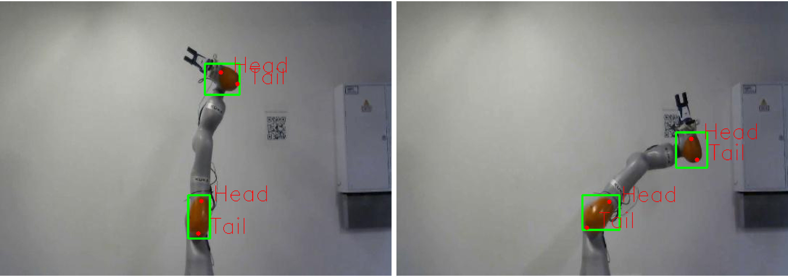

# Introduction to Computer Vision Project
### Innopolis University, Fall 2022
____________________
# Pose Estimation for a Robot Manipulator
__________________
## Team 
* Mirna Alnoukari
* Anton Buguev
* Elizaveta Kovanova

## Project description
This project proposes a solution for position estimation of a single industrial manipulator using learning methods.

The model uses Region Based Convolutional Neural Network (R-CNN) to track robot keypoints which allows to predict the pose of robotic manipulator. The keypoints are defined as:
* A robot joint;
* The joint's "head";
* The joint's "tail".


## Dataset 
Dataset was created and preprocessed using [Roboflow](https://roboflow.com/).
Available in a ```Keypoints.v2i.yolov5pytorch.zip``` archive.
This paper contains model description, information about dataset preparation and result analysis. The designed model demonstrates appropriate results by detecting manipulator joints position, which is the first step to estimate the pose of the robotic arm.

## Model
The model is created, saved, and tested in the ```Pose_estimation.ipynb```.

Jupiter Notebook ```Demonstration.ipynb``` is used for demonstration purposes, where both the dataset and model are loaded in to illustrate the predictions.

## Installation guide

### Prerequisites 
* ```python v3``` is required (v3.7+). Its installation guide can be found [here](https://www.python.org/downloads/)
* PyTorch Vision library for object detection
The necessery files can be obtained [from the repository](https://github.com/pytorch/vision/tree/main/references/detection) directly.
* Additionally, the following python libraries are required:
```
torch
torchvision
albumentations
cython
pycocotools
matplotlib
numpy
```
These can be installed using [```pip```](https://pip.pypa.io/en/stable/installation/)
### Further installation and launch
1. Clone the repository:
```
git clone https://github.com/mirnanoukari/Pose-Estimation.git
```
2. Run ```Pose_estimation.ipynb``` to create and save the model;
3. Run ```Demonstration.ipynb```.
